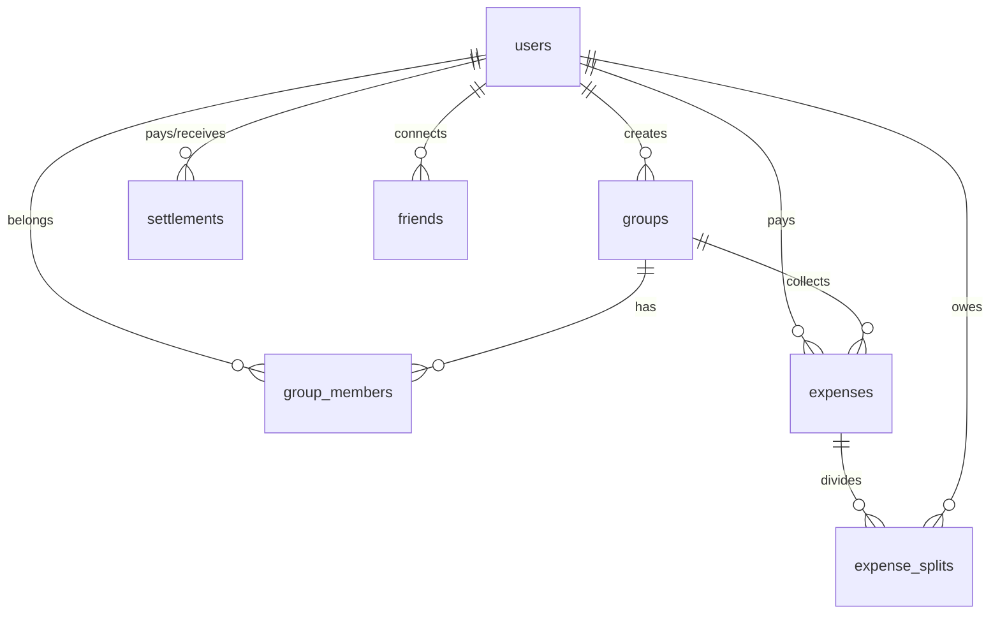

# SettleUp (Splitwise Clone)

SettleUp is a premium, full-stack, containerized web application designed to simplify tracking shared bills and expenses with friends and groups. Built with a modern dark-themed glassmorphic UI, custom analytical charts, a background recurrence daemon, and a greedy debt simplification engine, it offers a complete expense splitting solution from local development to production deployment on AWS EKS.

---

## Table of Contents
1. [Core Features](#1-core-features)
2. [Technology Stack](#2-technology-stack)
3. [Project Directory Structure](#3-project-directory-structure)
4. [Database Architecture & Schema](#4-database-architecture--schema)
5. [Key Algorithmic Implementations](#5-key-algorithmic-implementations)
6. [Local Development Setup](#6-local-development-setup)
7. [Running with Docker Compose](#7-running-with-docker-compose)
8. [Kubernetes (EKS) Production Deployment](#8-kubernetes-eks-production-deployment)
9. [Standard Operating Procedures & Troubleshooting](#9-standard-operating-procedures--troubleshooting)

---

## 1. Core Features

*   **User Authentication & Security**: Secure account creation and session authentication using `bcryptjs` password hashing and stateless JSON Web Tokens (JWT).
*   **Flexible Expense Splitting**: Create expenses divided among specific friends or group members, supporting exact custom division of split amounts.
*   **Group & Friend Management**: Create groups with custom description, add members by email, and automatically set up friendship linkages.
*   **Recurring Expenses Daemon**: A background job runner on the backend that periodically executes every 30 minutes to duplicate due recurring expenses (daily, weekly, monthly, yearly) and updates next recurrence dates.
*   **Receipt Attachments**: Express API processes uploaded receipt images (up to 10MB) via `multer` middleware, allowing users to save and view digital proof-of-purchase.
*   **Advanced Spending Analytics**: Beautiful, interactive spending graphics custom-rendered in React using SVG. Includes a category donut chart (Food, Lodging, Taxi, Utilities, Entertainment, General) and a 6-month historical spending trend bar graph.
*   **Chase Sapphire Card Linkage (BankSyncer)**: Simulates a secure bank connection to import transaction history (e.g., Starbucks, Uber, Airbnb) directly into split expenses with a single click.
*   **Greedy Debt Simplification**: A transaction minimization algorithm that processes net balances of group participants and computes the absolute minimum number of P2P transactions to settle all debts.
*   **Degraded Offline Mode**: Gracefully handles temporary database connection outages, allowing basic client connectivity and status routing while displaying detailed Oracle Cloud VM or network troubleshooting steps.

---

## 2. Technology Stack

### Frontend
*   **Core**: React 18 & Vite (fast HMR)
*   **Routing**: React Router DOM v7
*   **Icons**: Lucide React
*   **Styling**: Vanilla CSS utilizing responsive variables, grid/flex layouts, glassmorphic filters, and interactive transition animations.

### Backend
*   **Framework**: Node.js & Express (ES Modules)
*   **Authentication**: JSON Web Tokens (JWT) & bcrypt password hashing
*   **File Uploads**: Multer middleware
*   **DB Client**: Promise-based MySQL driver (`mysql2/promise`)

### Database
*   **Storage**: MySQL Relational Database with automatic table bootstrapping and schema updates on startup.

### Containerization & Deployment
*   **Docker**: Multistage builds for frontend (Vite static build served on Nginx) and backend.
*   **Docker Compose**: Multi-container orchestrator specifying backend, frontend, environment parameters, and database host routing.
*   **Kubernetes**: Native manifests configured for AWS EKS, utilizing Jetstack `cert-manager` (TLS Certificates), NGINX Gateway Fabric, Persistent Volumes (PVC), and secure configurations.

---

## 3. Project Directory Structure

```text
splitwise/
├── backend/                  # Node.js API Service
│   ├── config/               # DB connection pool configuration
│   ├── db/                   # Database schema setup (schema.sql)
│   ├── middleware/           # Authentication verification helpers
│   ├── routes/               # Express endpoints (auth, expenses, friends, groups, settlements)
│   ├── uploads/              # Local receipts repository (ignored in git)
│   ├── utils/                # Debt simplifier algorithm
│   ├── .env.example          # Sample environment credentials
│   ├── Dockerfile            # Container definition for backend
│   ├── server.js             # Main server entrypoint & recurring worker daemon
│   └── package.json          # Node dependencies and runtime commands
├── frontend/                 # Vite + React Web Application
│   ├── public/               # Static assets
│   ├── src/                  # React source tree
│   │   ├── components/       # Reusable components (BankSyncer, Analytics, modals)
│   │   ├── pages/            # View pages (Dashboard, Groups, Friends, Login)
│   │   ├── utils/            # API client wrapper & currency listing configurations
│   │   ├── App.css           # Global app layout styles
│   │   ├── index.css         # Styling system, variables, animations & glassmorphic tokens
│   │   └── main.jsx          # React renderer entrypoint
│   ├── Dockerfile            # Container configuration with Nginx distribution layer
│   ├── nginx.conf            # Web server routing rules for React single-page app
│   └── package.json          # Vite packages list
├── k8s/                      # Kubernetes deployment specifications
│   ├── 00-storageclass.yaml  # AWS gp3 CSI storage class
│   ├── 01-namespace.yaml     # Application namespace (splitwise)
│   ├── 02-backend-pvc.yaml   # Persistent Volume Claim for uploads directory
│   ├── 03-backend-secret.yaml# Secrets container for DB connections & JWT credentials
│   ├── 04-backend-deployment.yaml # ReplicaSet & container configurations for API service
│   ├── 05-backend-service.yaml   # Service endpoints mapping for backend pods
│   ├── 06-frontend-deployment.yaml# ReplicaSet configuration for React container
│   ├── 07-frontend-service.yaml  # Service endpoints mapping for frontend Nginx pods
│   ├── 08-gateway.yaml       # K8s Gateway API routing configurations
│   ├── 09-issuer.yaml        # Let's Encrypt TLS Issuer
│   ├── 09a-certificate.yaml  # ACME TLS certificate requests definition
│   ├── 10-cluster.yaml       # eksctl EKS cluster definition file
│   ├── CLUSTER_KB.md         # AWS EKS Core infrastructure provisioning guide
│   └── SOP.md                # Operations, diagnostics & troubleshooting manuals
└── docker-compose.yml        # Orchestration definitions for multi-container local execution
```

---

## 4. Database Architecture & Schema

The relational database is configured with 7 tables located in [schema.sql](file:///c:/Users/ajayk/.gemini/antigravity/scratch/splitwise/backend/db/schema.sql):

1.  **`users`**: Manages credentials, usernames, email addresses, and profiles.
2.  **`groups`**: Stores group metadata, default split preferences, and creator IDs.
3.  **`group_members`**: Resolves the many-to-many relationship of users inside groups.
4.  **`expenses`**: Tracks basic expense details, paid by, total amount, category, date, and recurrence configurations.
5.  **`expense_splits`**: Breaks down individual split amounts assigned to each user for a specific expense.
6.  **`settlements`**: Records transaction payments directly resolved between a payer and payee.
7.  **`friends`**: Registers explicit peer friendship pairings, enforcing unique combinations (always storing smaller user ID first).

### Relational Schema Diagram


---

## 5. Key Algorithmic Implementations

### Debt Simplification Algorithm
The core of SettleUp's settlement engine is a **Greedy Debt Simplification algorithm** located in [debtSimplifier.js](file:///c:/Users/ajayk/.gemini/antigravity/scratch/splitwise/backend/utils/debtSimplifier.js). 

Instead of multiple redundant transactions (e.g., A owes B $10, B owes C $10, C owes A $5), it computes the net balance of every user (positive for creditors, negative for debtors). It then:
1.  Filters out users with balanced books ($0).
2.  Sorts debtors (most negative first) and creditors (most positive first).
3.  Recursively pairs the largest debtor with the largest creditor.
4.  Computes the transaction amount: `Math.min(-debtor.balance, creditor.balance)`.
5.  Subtracts the transaction amount from their balances and moves pointers forward once settled, minimizing the overall number of transactions.

---

## 6. Local Development Setup

### Backend Setup
1.  Navigate to the backend folder:
    ```bash
    cd backend
    ```
2.  Install dependencies:
    ```bash
    npm install
    ```
3.  Configure variables. Copy `.env.example` to `.env`:
    ```bash
    cp .env.example .env
    ```
    Set your MySQL connection credentials:
    ```ini
    PORT=5000
    DB_HOST=127.0.0.1
    DB_PORT=3306
    DB_USER=root
    DB_PASSWORD=your_mysql_password
    DB_NAME=splitwise
    JWT_SECRET=your_jwt_signing_secret_key
    JWT_EXPIRE=7d
    ```
4.  Start development server:
    ```bash
    npm run dev
    ```

### Frontend Setup
1.  Navigate to the frontend folder:
    ```bash
    cd ../frontend
    ```
2.  Install dependencies:
    ```bash
    npm install
    ```
3.  Start development server:
    ```bash
    npm run dev
    ```
    *The web application will open by default at `http://localhost:5173`.*

---

## 7. Running with Docker Compose

To boot the entire ecosystem (React app, Express API, connecting to your preconfigured MySQL instance) in containers:

1.  Open the root project directory.
2.  Inspect environment properties inside [docker-compose.yml](file:///c:/Users/ajayk/.gemini/antigravity/scratch/splitwise/docker-compose.yml). Ensure the `DB_HOST` matches your database address.
3.  Build and boot the containers:
    ```bash
    docker-compose up --build
    ```
4.  Access the web interface at: `http://localhost:8080` (proxying traffic to Nginx and API service on port `5000`).

---

## 8. Kubernetes (EKS) Production Deployment

Production architecture is configured using Kubernetes Gateway API, Jetstack cert-manager (Automatic Let's Encrypt TLS certificates), NGINX Gateway Fabric, and EBS CSI driver for persistent receipts storage.

For detailed steps, refer to [CLUSTER_KB.md](file:///c:/Users/ajayk/.gemini/antigravity/scratch/splitwise/k8s/CLUSTER_KB.md):

1.  **Cluster Provisioning**:
    ```bash
    eksctl create cluster -f k8s/10-cluster.yaml
    ```
2.  **Storage Setup (AWS EBS CSI)**:
    Install AWS EBS CSI driver and create the `gp3` storage class.
3.  **Gateway API & NGINX Gateway Fabric**:
    Apply the CRDs and install NGF using Helm:
    ```bash
    kubectl apply -f https://github.com/kubernetes-sigs/gateway-api/releases/download/v1.1.0/standard-install.yaml
    helm install ngf oci://ghcr.io/nginx/charts/nginx-gateway-fabric -n nginx-gateway --create-namespace
    ```
4.  **Cert-Manager**:
    ```bash
    helm install cert-manager jetstack/cert-manager --namespace cert-manager --create-namespace --set installCRDs=true --set config.enableGatewayAPI=true
    ```
5.  **Workloads Deployment**:
    Apply namespace, volume claims, secrets, and workload deployments:
    ```bash
    kubectl apply -f k8s/01-namespace.yaml
    kubectl apply -f k8s/02-backend-pvc.yaml
    kubectl apply -f k8s/secrets.yaml
    kubectl apply -f k8s/04-backend-deployment.yaml
    kubectl apply -f k8s/05-backend-service.yaml
    kubectl apply -f k8s/06-frontend-deployment.yaml
    kubectl apply -f k8s/07-frontend-service.yaml
    kubectl apply -f k8s/08-gateway.yaml
    kubectl apply -f k8s/09-issuer.yaml
    kubectl apply -f k8s/09a-certificate.yaml
    ```

---

## 9. Standard Operating Procedures & Troubleshooting

For full diagnostics, read [SOP.md](file:///c:/Users/ajayk/.gemini/antigravity/scratch/splitwise/k8s/SOP.md). Below is a summary of major issues resolved in production:

*   **MySQL Access Denied (500 Error)**: 
    *   *Symptom*: Pod fails to communicate with Oracle VM database.
    *   *Resolution*: Update [secrets.yaml](file:///c:/Users/ajayk/.gemini/antigravity/scratch/splitwise/k8s/secrets.yaml) to map user to `wms_app`. Grant privileges to connect from remote hosts in MySQL console:
        ```sql
        CREATE USER IF NOT EXISTS 'wms_app'@'%' IDENTIFIED BY 'Ajaykumar@12.';
        GRANT ALL PRIVILEGES ON splitwise.* TO 'wms_app'@'%';
        FLUSH PRIVILEGES;
        ```
*   **Missing NGINX Gateway External Load Balancer IP**:
    *   *Root Cause*: Data plane services are provisioned in the same namespace as the `Gateway` resource, not the controller namespace.
    *   *Resolution*: Look for the service in the application namespace: `kubectl get service -n splitwise`.
*   **Stuck Let's Encrypt Certificate (Pending Challenge)**:
    *   *Root Cause*: Feature flag `enableGatewayAPI` not set to true in cert-manager installation, preventing automatic HTTPRoute challenge solver provisioning.
    *   *Resolution*: Upgrade the cert-manager Helm chart with `--set config.enableGatewayAPI=true` and rollout restart.
# settleUp

